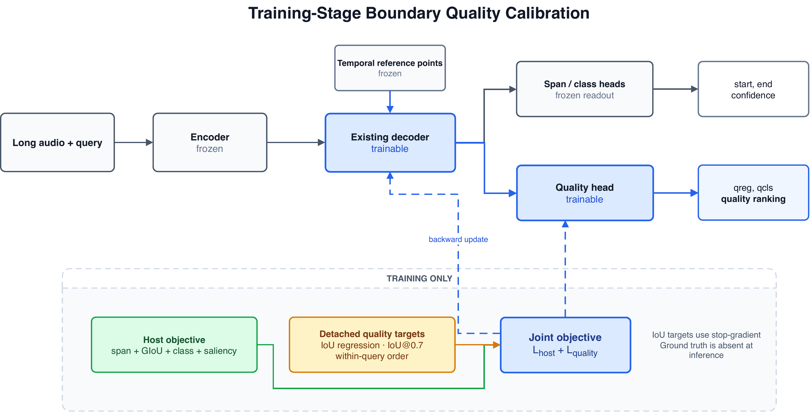

<div align="center">

# Boundary Quality Calibration for Audio Moment Retrieval

**When a good moment is already in the candidate pool, the ranking score should know it.**

[](https://www.python.org/)
[](https://pytorch.org/)
[](LICENSE)
[](results/mechanism_ablation_20260711.md)

</div>

## The Story

Audio Moment Retrieval (AMR) locates the start and end time of a moment in a
long audio recording from a natural-language query. A DETR-style AMR system
generates several candidate windows and selects the one with the highest
foreground confidence.

The central observation behind this project is simple:

> **Foreground confidence answers whether a candidate looks relevant. It does
> not directly answer whether its temporal boundaries are accurate.**

This distinction matters on CASTELLA. The frozen QD-DETR host obtains **14.33%
R1@0.7**, while selecting the best available candidate with Oracle@10 reaches
**28.88%**. The candidate pool therefore contains substantial unused boundary
quality. The system often generates a better window but assigns it a lower
confidence score.

Several summary-based post-hoc rerankers were tested first. Their exported
audio-text, saliency, geometry, and decoder-summary signals did not reliably
improve selection within each query. Candidate quality needed to be learned
where the candidate representation itself is formed.

## Boundary Quality Calibration

Boundary Quality Calibration (BQC-Dec) teaches each decoder candidate to
estimate its own temporal quality during host training. The original candidate
generation path remains intact, while an additional quality score is learned
from three complementary views of a candidate:

- how closely its boundaries overlap the annotated moment;
- whether it satisfies the strict IoU@0.7 evaluation criterion;
- how it should be ordered against other candidates for the same query.

At inference, no annotation is available or required. Candidates are generated
normally and ranked by the learned quality score.

<p align="center">
  
</p>

## What the Evidence Shows

Across five seeds on the CASTELLA development-testing reporting split,
BQC-Dec reaches **17.76 +/- 0.27 R1@0.7**. Compared with matched decoder
adaptation trained only with the host objective, explicit boundary-quality
supervision contributes a controlled gain of **+1.56 percentage points**.

Two additional controls clarify where the gain comes from:

- On identical predicted windows, quality ranking improves R1@0.7 by **+1.45
  points** over the original confidence ranking.
- Shuffling the quality labels removes the improvement, indicating that the
  gain depends on meaningful boundary-quality supervision rather than an extra
  head or generic fine-tuning.

The result supports a focused conclusion: **candidate generation and candidate
selection are different problems in AMR. When useful windows already exist,
training the score to reflect temporal boundary quality improves which window
is returned.**

## Scope

The current evidence covers QD-DETR on CASTELLA. BQC-Dec improves selection
within the generated candidate pool; it cannot recover an event that the host
never proposes, and it does not directly move candidate boundaries at
inference. Cross-host validation remains future work.

The reported split is CASTELLA development-testing. Model selection and score
selection use development-validation. The separate DCASE challenge evaluation
set does not provide public temporal annotations and is not used for the claims
in this repository.

## Repository Guide

```text
.
|-- assets/          Method figure and editable draw.io source
|-- src/             QD-DETR baseline and BQC implementation
|-- patches/         Patch for applying BQC to a compatible host checkout
|-- scripts/         Experiment and mechanism-control entry points
|-- results/         Verified five-seed summaries
|-- audits/          Machine-readable parameter audits
|-- tests/           Source-level invariants
`-- docs/            Architecture, experiment map, and code audit
```

Start with the following documents when inspecting or reproducing the work:

- [Experiment map](docs/EXPERIMENT_MAP.md)
- [Architecture notes](docs/ARCHITECTURE.md)
- [Detached-target mechanism study](results/mechanism_ablation_20260711.md)
- [Five-seed calibration audit](results/calibration_audit_20260712.md)
- [Code and target audit](docs/CODE_AUDIT.md)

The repository contains source code, patches, controls, and verified summaries.
Dataset features and trained checkpoints are not redistributed. Historical
non-detached code is retained only for provenance; current claims use the
corrected detached-target implementation in `src/bqc/`.

## References

- N. Carion et al., “End-to-End Object Detection with Transformers,” ECCV,
  2020. [Paper](https://arxiv.org/abs/2005.12872)
- W. Moon et al., “Query-Dependent Video Representation for Moment Retrieval
  and Highlight Detection,” CVPR, 2023.
  [Paper](https://arxiv.org/abs/2303.13874) ·
  [Code](https://github.com/wjun0830/QD-DETR)
- H. Munakata et al., “Language-based Audio Moment Retrieval,” ICASSP, 2025.
  [Paper](https://arxiv.org/abs/2409.15672)
- H. Munakata et al., “CASTELLA: Long Audio Dataset with Captions and Temporal
  Boundaries,” 2026. [Paper](https://arxiv.org/abs/2511.15131)

## Acknowledgements

This project builds on DETR, Moment-DETR, QD-DETR, and the DCASE 2026 Audio
Moment Retrieval baseline. Their open-source implementations and task design
made this study possible.
